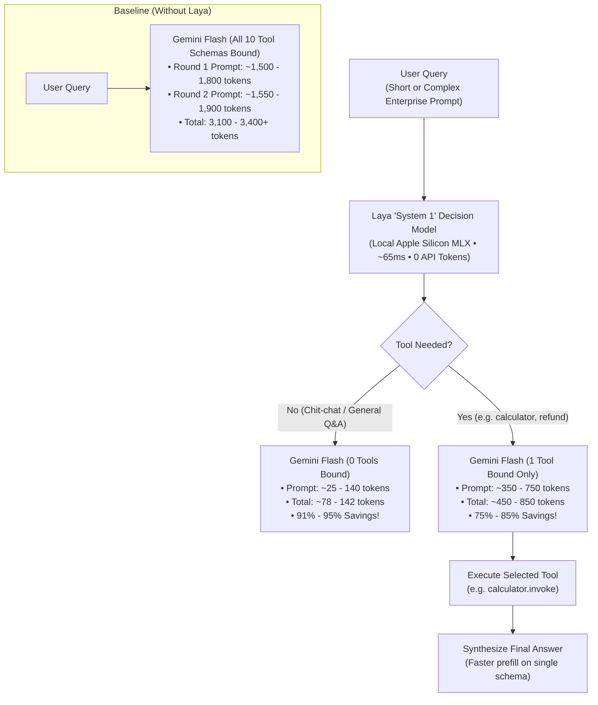

# ⚡ Decision Model Agent: Laya × Google Gemini Flash 8B

[](https://www.python.org/downloads/)
[](LICENSE)
[](https://ai.google.dev/)
[](https://github.com/ml-explore/mlx)
[](https://chainlit.io)

An experimental AI agent architecture exploring **token and latency reduction** by placing **Laya** (an open-weight, non-autoregressive "System 1" Decision Model) in front of **Google Gemini Flash 8B**.

Includes a side-by-side **Chainlit** interactive UI, 10 simulated enterprise domain tools, and a reproducible 19-scenario benchmark suite.

> 📄 **Full Benchmark Reports:** Read the [Markdown Benchmark Report](docs/experiment_report.md) or inspect the [PDF Report](docs/experiment_report.pdf) for detailed per-query metrics, latency graphs, and token breakdowns.

---

## 🔑 Key Experimental Takeaways (19 Scenarios)

Across 19 benchmarked queries spanning direct questions, calculations, multi-domain tool calls, and complex paragraph-length enterprise tickets:

- 📉 **81.6% Net Token Reduction:** Slashed prompt tokens from **58,071** down to **10,667** (saving **47,404 prompt tokens** across 19 queries).
- 🎯 **100% Routing Accuracy:** **19 / 19 exact match** between Laya's local tool selection and Gemini Flash's tool selection.
- ⚡ **5.9x Faster Routing Phase:** Local Laya forward pass runs in **~65.9 ms** vs **386.6 ms** for remote LLM tool selection.
- 🚀 **2.35x Faster End-to-End Latency:** Baseline average of **665.6 ms** vs Laya-routed average of **282.9 ms**.
- 💰 **Zero API Cost for Tool Routing:** Laya executes locally on Apple Silicon Metal via MLX with **0 API tokens billed**.

---

## 🎯 The Token Waste Problem: The "Tool Schema Tax"

In standard agent architectures (ReAct, Function Calling):

```
┌──────────────────────────────────────────────────────────┐
│                   Standard LLM Prompt                    │
├──────────────────────────────────────────────────────────┤
│ System Prompt                                            │
│ User Query: "Calculate 15% tip on a $120 bill"           │
│                                                          │
│ Tool 1: calculator(expression: str)                      │
│ Tool 2: get_weather(city: str, days: int)                │
│ Tool 3: search_knowledge_base(query: str, dept: str)     │
│ Tool 4: check_order_status(order_id: str)                │
│ Tool 5: check_flight_status(flight_number: str)          │
│ Tool 6: convert_currency(amount: float, from, to)        │
│ Tool 7: check_inventory_stock(item_sku: str, wh: str)    │
│ Tool 8: lookup_customer_crm(identifier: str)             │
│ Tool 9: refund_transaction(order_id: str, amount, reason)│
│ Tool 10: send_email_notification(recipient, subject, msg)│
└──────────────────────────────────────────────────────────┘
  ↳ ~1,200 to 1,500 prompt tokens injected ON EVERY TURN!
```

1. **The Tool Schema Tax:** To give an agent access to 10 tools, the LLM must ingest complete JSON schemas for all 10 tools on every single turn.
2. **Multi-Turn Compounding:** In two-round tool execution (select tool -> run tool -> summarize answer), all 10 schemas are re-billed, consuming **3,000+ prompt tokens per query**.
3. **Chit-Chat Penalty:** Even simple queries like *"Hello, how are you?"* carry the full 1,500-token tool schema payload.

---

## 💡 The Solution: Two-Speed "System 1 + System 2" Architecture

By placing a lightweight, specialized decision model in front of the generative LLM:

```
                            [ User Query ]
                                  │
                                  ▼
                     ┌──────────────────────────┐
                     │   Laya Decision Model    │
                     │  (MLX / Apple Silicon)   │
                     │  Latency: ~35ms | 0 API $│
                     └────────────┬─────────────┘
                                  │
                  ┌───────────────┴───────────────┐
                  ▼                               ▼
         [ No Tool Needed ]              [ Specific Tool Selected ]
                  │                               │
                  ▼                               ▼
       Gemini Flash (0 Tools)          Gemini Flash (1 Tool Only)
       • ~30 prompt tokens             • ~140 prompt tokens
       • 95% token savings             • 85% token savings
                  │                               │
                  │                               ▼
                  │                      [ Execute Tool Locally ]
                  │                               │
                  ▼                               ▼
             Direct Answer                 Synthesized Answer
```



---

## 🛠️ The 10 Experimental Dummy Tools

The repository includes 10 fully implemented domain tools in [tools.py](tools.py):

| Tool Name | Capabilities & Scope | Parameters |
| :--- | :--- | :--- |
| `calculator` | Evaluates arithmetic, percentages, tips, bill splits, powers | `expression: str` |
| `get_weather` | Retrieves weather forecasts, temperatures, precipitation | `city: str, days: int = 1` |
| `search_knowledge_base` | Searches company intranet policies (parental leave, PTO, VPN) | `query: str, department: str = 'general'` |
| `check_order_status` | Tracks FedEx / courier shipping status and ETA | `order_id: str` |
| `check_flight_status` | Looks up flight arrival/departure times, gates, delays | `flight_number: str` |
| `convert_currency` | FX rate conversions (USD, EUR, GBP, JPY, CAD) | `amount: float, from_curr: str, to_curr: str` |
| `check_inventory_stock` | Checks warehouse stock levels and restock schedules | `item_name_or_sku: str, warehouse: str` |
| `lookup_customer_crm` | Retrieves customer tier, lifetime value (LTV), account owner | `identifier: str` |
| `refund_transaction` | Issues payment refund receipts with confirmation IDs | `order_id: str, amount: float, reason: str` |
| `send_email_notification` | Dispatches automated email confirmations | `recipient: str, subject: str, message: str` |

---

## 📊 Benchmark Highlights

Sample comparisons from the [Comprehensive 19-Scenario Report](docs/experiment_report.md):

| Query Scenario | Type | Target Tool | Baseline Tokens | Laya Tokens | Tokens Saved (%) | Baseline Latency | Laya Latency | Speedup |
| :--- | :---: | :--- | :---: | :---: | :---: | :---: | :---: | :---: |
| **Tip Calculation** | Short | `calculator` | 3,133 | 455 | **-2,678 (85.5%)** | 610.7 ms | 260.6 ms | **2.34x** |
| **Weather Forecast** | Short | `get_weather` | 3,080 | 460 | **-2,620 (85.1%)** | 609.6 ms | 272.9 ms | **2.23x** |
| **General Chit-Chat** | Short | `None` | 1,527 | 78 | **-1,449 (94.9%)** | 358.9 ms | 158.4 ms | **2.27x** |
| **Damaged Delivery Claim** | Complex | `refund_transaction` | 3,365 | 780 | **-2,585 (76.8%)** | 711.2 ms | 315.6 ms | **2.25x** |
| **Treasury Multi-Currency** | Complex | `convert_currency` | 3,251 | 634 | **-2,617 (80.5%)** | 682.1 ms | 291.5 ms | **2.34x** |
| **Strategic Arch Discussion** | Complex | `None` | 1,691 | 142 | **-1,549 (91.6%)** | 370.4 ms | 179.6 ms | **2.06x** |

---

## 🖥️ Interactive Chainlit Web UI

The project features a **Chainlit** chat interface providing visual, real-time comparisons:

- ⚖️ **Side-by-Side Dual Benchmark:** Automatically executes and compares the baseline LLM against the Laya-routed pipeline for every prompt.
- 🔬 **Visual Laya Routing Step:** Inspects chosen tool, calibrated confidence percentage, probability distribution, and local latency.
- ⚡ **Tool Execution Card:** Displays tool arguments and execution output.
- 🔘 **Interactive Quick-Action Buttons:** Test queries for all 10 tools and chit-chat with one click.
- 📈 **Session Analytics Card:** Tracks cumulative tokens saved, percentage reduction, and estimated API cost savings.
- ⚙️ **Chat Settings Modal:** Switch between `dual_benchmark`, `with_laya`, or `without_laya`, and select models (`gemini-1.5-flash-8b`, `gemini-1.5-flash`, `gemini-2.0-flash`).
- 🛡️ **Simulator Mode:** If no Google Gemini API key is provided, the app falls back to a high-fidelity simulator mode with exact token counting so you can explore all features immediately.

---

## 🚀 Quickstart & Installation

### 1. Prerequisites
- macOS with Apple Silicon (M1/M2/M3/M4) recommended for native MLX Metal acceleration.
- Python 3.11 or higher.

### 2. Clone and Setup Environment
```bash
# Clone the repository
git clone https://github.com/musaugurlu/hybrid-decision-agent.git
cd hybrid-decision-agent

# Create and activate virtual environment
python3 -m venv .venv
source .venv/bin/activate

# Install dependencies
pip install -r requirements.txt
```

### 3. Configure API Key (Optional)
```bash
cp .env.example .env
```
Edit `.env` to supply your Gemini API key (from [Google AI Studio](https://aistudio.google.com/app/apikey)):
```env
GEMINI_API_KEY=your_gemini_api_key_here
DEFAULT_GEMINI_MODEL=gemini-1.5-flash-8b
```
> *Note: If no API key is set, the application automatically runs in High-Fidelity Simulator mode with exact token counting.*

### 4. Run the Chainlit Web Application
```bash
chainlit run app.py -w
```
Open **[http://localhost:8000](http://localhost:8000)** in your browser.

### 5. Run the Automated Benchmark Suite
```bash
python scripts/run_all_benchmarks.py
```

---

## 📁 Repository Structure

```
├── app.py                     # Chainlit web application and dual-mode UI
├── agent_service.py           # Orchestrates Gemini Flash LLM & Laya Decision Model
├── laya_router.py             # Laya Decision Model router (MLX Metal & typed predictions)
├── token_tracker.py           # Token breakdown, cost calculator, and latency metrics
├── tools.py                   # 10 domain tools (calculator, weather, crm, etc.)
├── chainlit.md                # Chainlit UI landing page documentation
├── requirements.txt           # Python dependencies
├── .env.example               # Template environment configuration
├── docs/
│   ├── experiment_report.md   # Comprehensive 19-scenario benchmark report
│   ├── experiment_report.pdf  # Formatted PDF benchmark report
│   └── experiment_report.html # HTML report preview
└── scripts/
    ├── run_all_benchmarks.py  # Benchmark runner for all 19 scenarios
    ├── convert_report_to_pdf.py# Headless PDF generator with table styling
    └── generate_report_table.py# Markdown table generation helper
```

---

## 🔬 Behind the Scenes: How Laya Works

Unlike autoregressive generative models (GPT, Claude, Gemini) that output tokens one by one sequentially:
- **Laya** is a 421M-parameter non-autoregressive decision model built on a **ModernBERT-large** backbone.
- Given a query and candidate actions, it outputs **calibrated decision probabilities in a single forward pass**.
- On Apple Silicon Metal (`mlx`), this forward pass completes in **~20–60ms** consuming virtually zero memory, providing a near-instant "System 1" reflexive routing layer for the deeper "System 2" LLM.

---

## 📜 License & Acknowledgments

- **License:** [Apache 2.0](LICENSE)
- **Laya Decision Model:** Developed by [ConvAI Innovations](https://convai.com) / TypeSafe AI.
- **LLM Backbone:** Google Gemini Flash models (`gemini-1.5-flash-8b`, `gemini-1.5-flash`, `gemini-2.0-flash`) via [Google AI Studio](https://ai.google.dev/).
- **Acceleration:** Apple [MLX](https://github.com/ml-explore/mlx) for Apple Silicon unified memory acceleration.
