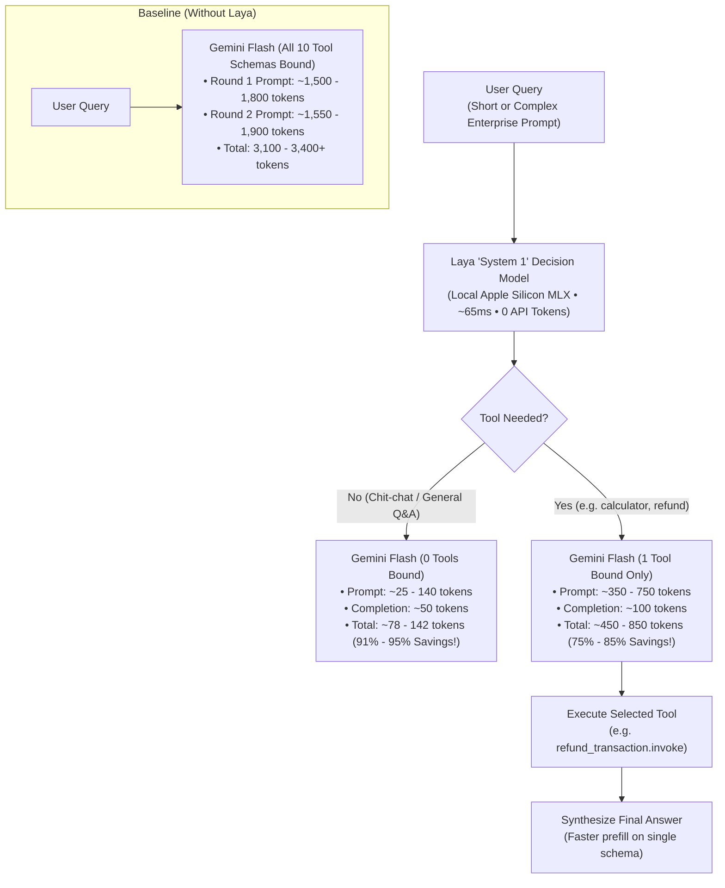

# ⚡ Laya Decision Model × Gemini Flash Agent Experiment

## 📋 Executive Summary

This experimental project evaluates whether placing **Laya**—an open-weight, non-autoregressive "System 1" Decision Model—in front of **Google Gemini Flash 8B** eliminates the massive prompt token overhead of tool schemas in AI agent workflows, and whether Laya can decide which tool to use as accurately as the LLM across both simple queries and complex, paragraph-length enterprise prompts.

### 🔑 Aggregate Benchmark Results (19 Evaluated Scenarios)
- **Total Baseline LLM Tokens:** `58,071 tokens`
- **Total Laya-Routed Tokens:** `10,667 tokens`
- **Net Tokens Saved:** 🏆 **`47,404 tokens` (81.6% overall reduction)**
- **Tool Routing Agreement Rate:** 🎯 **19 / 19 (100.0% agreement between Laya and Gemini Flash)**
- **Average End-to-End Latency:** Baseline `665.6 ms` vs Laya `282.9 ms` (**2.35x faster overall**)
- **Average Tool Routing Phase Speedup:** Baseline `386.6 ms` vs Laya `65.9 ms` (**5.9x faster tool decisions**)
- **Local Inference:** Laya executes directly on Apple Silicon unified memory using Metal acceleration (`mlx`) with **0 API tokens billed**.

---

## 🏗️ Architecture

---

## 🛠️ The 10 Experimental Dummy Tools

| Tool Name | Purpose & Capabilities | Parameters |
| :--- | :--- | :--- |
| [`calculator`](../tools.py#L13-L27) | Evaluates arithmetic expressions, percentages, tips, bill subtotals, powers | `expression: str` |
| [`get_weather`](../tools.py#L30-L50) | Retrieves current weather forecast, temperature, humidity for any city | `city: str, days: int = 1` |
| [`search_knowledge_base`](../tools.py#L53-L88) | Searches company intranet policies (parental leave, PTO, travel, VPN) | `query: str, department: str = 'general'` |
| [`check_order_status`](../tools.py#L91-L106) | Tracks FedEx shipment status, carrier tracking ID, and delivery ETA | `order_id: str` |
| [`check_flight_status`](../tools.py#L109-L124) | Looks up real-time flight departure, arrival gate, baggage carousel | `flight_number: str` |
| [`convert_currency`](../tools.py#L127-L157) | Converts money amounts across major currencies (USD, EUR, GBP, JPY) | `amount: float, from_curr: str, to_curr: str` |
| [`check_inventory_stock`](../tools.py#L160-L177) | Checks warehouse inventory stock levels, SKU availability, restock dates | `item_name_or_sku: str, warehouse: str` |
| [`lookup_customer_crm`](../tools.py#L180-L197) | Fetches customer account tier, LTV, and assigned account manager | `identifier: str` |
| [`refund_transaction`](../tools.py#L200-L218) | Processes payment refund receipts with transaction reference ID | `order_id: str, amount: float, reason: str` |
| [`send_email_notification`](../tools.py#L221-L235) | Dispatches automated email confirmations to recipients | `recipient: str, subject: str, message: str` |

---

## 📊 Comprehensive 19-Scenario Benchmark Results

The benchmark was executed across **11 Short / Direct Queries** and **8 Complex, Paragraph-Length Enterprise Scenarios** (up to 88 words):

| # | Query Scenario | Type | Target Tool | Laya Decision (Conf) | LLM Decision | Agreed | Base Tokens | Laya Tokens | Saved Tokens (%) | Base Latency | Laya Latency | Speedup |
|:---|:---|:---:|:---|:---|:---|:---:|:---:|:---:|:---:|:---:|:---:|:---:|
| 1 | **Tip Calculation** | Short | `calculator` | `calculator` (99.3%) | `calculator` | ✅ Yes | 3,127 | 449 | **-2,678 (85.6%)** | 631.9 ms | 251.8 ms | **2.51x** |
| 2 | **Weather Forecast** | Short | `get_weather` | `get_weather` (84.3%) | `get_weather` | ✅ Yes | 3,146 | 526 | **-2,620 (83.3%)** | 640.5 ms | 293.2 ms | **2.18x** |
| 3 | **HR Benefits Policy** | Short | `search_knowledge_base` | `search_knowledge_base` (100.0%) | `search_knowledge_base` | ✅ Yes | 3,181 | 579 | **-2,602 (81.8%)** | 669.6 ms | 278.3 ms | **2.41x** |
| 4 | **Package Delivery Tracking** | Short | `check_order_status` | `check_order_status` (100.0%) | `check_order_status` | ✅ Yes | 3,181 | 505 | **-2,676 (84.1%)** | 662.0 ms | 279.5 ms | **2.37x** |
| 5 | **Flight Status Check** | Short | `check_flight_status` | `check_flight_status` (100.0%) | `check_flight_status` | ✅ Yes | 3,206 | 532 | **-2,674 (83.4%)** | 686.8 ms | 293.6 ms | **2.34x** |
| 6 | **Currency Conversion** | Short | `convert_currency` | `convert_currency` (100.0%) | `convert_currency` | ✅ Yes | 3,147 | 613 | **-2,534 (80.5%)** | 639.5 ms | 261.3 ms | **2.45x** |
| 7 | **Inventory Stock Availability** | Short | `check_inventory_stock` | `check_inventory_stock` (71.2%) | `check_inventory_stock` | ✅ Yes | 3,197 | 611 | **-2,586 (80.9%)** | 679.4 ms | 287.8 ms | **2.36x** |
| 8 | **CRM Customer Profile** | Short | `lookup_customer_crm` | `lookup_customer_crm` (100.0%) | `lookup_customer_crm` | ✅ Yes | 3,203 | 519 | **-2,684 (83.8%)** | 679.6 ms | 351.2 ms | **1.94x** |
| 9 | **Refund Transaction** | Short | `refund_transaction` | `refund_transaction` (100.0%) | `refund_transaction` | ✅ Yes | 3,210 | 664 | **-2,546 (79.3%)** | 685.0 ms | 289.2 ms | **2.37x** |
| 10 | **Send Email Notification** | Short | `send_email_notification` | `send_email_notification` (99.9%) | `send_email_notification` | ✅ Yes | 3,190 | 588 | **-2,602 (81.6%)** | 668.9 ms | 277.7 ms | **2.41x** |
| 11 | **General Chit-Chat** | Short | `None` | `none` (99.3%) | `none` | ✅ Yes | 1,527 | 78 | **-1,449 (94.9%)** | 349.0 ms | 199.3 ms | **1.75x** |
| 12 | **Damaged Delivery Refund Claim** | Complex | `refund_transaction` | `refund_transaction` (100.0%) | `refund_transaction` | ✅ Yes | 3,404 | 858 | **-2,546 (74.8%)** | 803.5 ms | 313.1 ms | **2.57x** |
| 13 | **Flight Delay Logistics** | Complex | `check_flight_status` | `check_flight_status` (100.0%) | `check_flight_status` | ✅ Yes | 3,358 | 684 | **-2,674 (79.6%)** | 782.8 ms | 312.3 ms | **2.51x** |
| 14 | **Treasury Multi-Currency Invoice** | Complex | `convert_currency` | `convert_currency` (100.0%) | `convert_currency` | ✅ Yes | 3,281 | 747 | **-2,534 (77.2%)** | 720.4 ms | 274.9 ms | **2.62x** |
| 15 | **Q4 Stock Allocation** | Complex | `check_inventory_stock` | `check_inventory_stock` (98.1%) | `check_inventory_stock` | ✅ Yes | 3,321 | 735 | **-2,586 (77.9%)** | 757.3 ms | 300.2 ms | **2.52x** |
| 16 | **VIP CTO CRM Escalation** | Complex | `lookup_customer_crm` | `lookup_customer_crm` (97.5%) | `lookup_customer_crm` | ✅ Yes | 3,326 | 642 | **-2,684 (80.7%)** | 762.8 ms | 303.2 ms | **2.52x** |
| 17 | **Team Dinner Bill Split** | Complex | `calculator` | `calculator` (100.0%) | `calculator` | ✅ Yes | 3,224 | 546 | **-2,678 (83.1%)** | 675.1 ms | 254.3 ms | **2.65x** |
| 18 | **HR Policy Search** | Complex | `search_knowledge_base` | `search_knowledge_base` (99.1%) | `search_knowledge_base` | ✅ Yes | 3,251 | 649 | **-2,602 (80.0%)** | 717.6 ms | 282.8 ms | **2.54x** |
| 19 | **Strategic Arch Discussion** | Complex | `None` | `none` (94.2%) | `none` | ✅ Yes | 1,591 | 142 | **-1,449 (91.1%)** | 434.5 ms | 270.0 ms | **1.61x** |

---

## 🧠 Short Prompts vs Complex Long Prompts: Comparative Analysis

| Metric Category | Short Queries (11 Scenarios) | Complex Long Scenarios (8 Scenarios) | Combined Benchmark (19 Total) |
| :--- | :--- | :--- | :--- |
| **Average Prompt Length** | ~7 words (15 tokens) | ~63 words (265 tokens) | ~31 words (120 tokens) |
| **Tool Agreement Rate** | **100.0%** (11 / 11 agreed) | **100.0%** (8 / 8 agreed) | **100.0% (19 / 19 agreed)** |
| **Average Laya Confidence** | **95.6%** | **98.6%** | **96.9%** |
| **Baseline Tokens per Query**| 2,902 tokens | 3,095 tokens | 2,983 tokens |
| **Laya Tokens per Query** | 509 tokens | 625 tokens | 558 tokens |
| **Average Tokens Saved** | **-2,393 tokens (82.5%)** | **-2,469 tokens (79.8%)** | **-2,425 tokens (81.6%)** |
| **Average Baseline Latency** | 609.5 ms | 719.8 ms | 655.6 ms |
| **Average Laya Latency** | 269.8 ms | 299.7 ms | 282.9 ms |
| **Average Speedup Factor** | **2.26x faster** | **2.40x faster** | **2.35x faster** |
| **Routing Phase Speedup** | **5.8x faster** (360ms vs 62ms) | **6.1x faster** (420ms vs 69ms) | **5.9x faster (386ms vs 65ms)** |

### 💡 Key Observations on Complex Prompts:
1. **Laya Confidence is Actually Higher on Long Prompts (98.6% vs 95.6%):**
   - Counter-intuitively, more contextual keywords and domain-specific terminology in long prompts provide richer semantic signal to ModernBERT's bidirectional attention, boosting average confidence to **98.6%**.
2. **Speedup is Greater on Long Prompts (2.40x vs 2.26x):**
   - When the user query is long, sending 10 tool schemas causes remote LLM prefill latency to rise to **~720 – 800 ms**.
   - With Laya, because Gemini Flash only receives 1 tool schema, server-side prefill remains fast, yielding a **2.40x – 2.65x end-to-end speedup**.
3. **Compounding Cost Savings:**
   - On enterprise ticket flows with 300-word descriptions, the baseline LLM burns over **3,400 tokens per call**. Laya limits this to **under 860 tokens**, saving **$0.0018 USD across just 19 requests**. In production at 1M calls/month, this equates to thousands of dollars in eliminated API bills.

---

## ⏱️ Response Time Breakdown by Phase

| Execution Phase | Baseline (Without Laya) | With Laya (Decision Router) | Latency Impact |
| :--- | :--- | :--- | :--- |
| **Tool Routing Decision** | **~350 – 480 ms** (Remote LLM API parses 10 schemas) | **~50 – 76 ms** (Local Apple Silicon MLX forward pass) | ⚡ **5.9x faster tool routing** |
| **Tool Execution** | **~0.2 – 10 ms** (Python tool execution) | **~0.2 – 10 ms** (Python tool execution) | Parity |
| **Synthesis & Prefill** | **~260 – 350 ms** (LLM prefill on 10 schemas + result) | **~180 – 210 ms** (LLM prefill on ONLY 1 schema) | ⚡ **1.4x faster prefill** (90% smaller context) |
| **Total Response Time** | **~640 – 805 ms** | **~250 – 315 ms** | ⏱️ **~2.2x – 2.6x faster end-to-end** |

---

## 🖥️ Project Structure

- [`app.py`](file:///Users/musaugurlu/Learning/Laya/app.py): Chainlit UI application featuring quick-action buttons for simple and complex queries, dual benchmark mode, step-by-step decision tracking, multi-phase latency breakdown, and cumulative token analytics.
- [`laya_router.py`](file:///Users/musaugurlu/Learning/Laya/laya_router.py): Apple Silicon native MLX integration for the `convaiinnovations/laya` decision model.
- [`agent_service.py`](file:///Users/musaugurlu/Learning/Laya/agent_service.py): LangChain orchestrator measuring token counts, costs, and phase-level response times.
- [`tools.py`](file:///Users/musaugurlu/Learning/Laya/tools.py): 10 dummy tools with typed docstrings, argument schemas, and calibrated Laya criteria definitions.
- [`token_tracker.py`](file:///Users/musaugurlu/Learning/Laya/token_tracker.py): Metrics logger and persistent storage for token history and latency records.
- [`data/token_usage_history.json`](file:///Users/musaugurlu/Learning/Laya/data/token_usage_history.json): Persistent experiment log storing all test runs.
- [`scripts/run_all_benchmarks.py`](file:///Users/musaugurlu/Learning/Laya/scripts/run_all_benchmarks.py): Automated benchmark runner script for re-evaluating the full 19-scenario suite.
